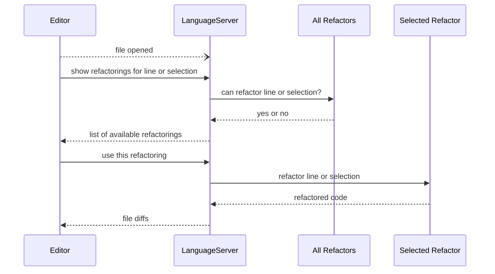

# Refactorex

Refactorex is a TCP server that implements the Language Server Protocol
to enhance editors with Elixir refactoring code actions, inspired on the 
[catalog of Elixir refactorings](https://github.com/lucasvegi/Elixir-Refactorings)

- [VS Code extension](https://github.com/gp-pereira/refactorex-vscode)

## How it works

## Acknowledgements

- [Sourceror](https://github.com/doorgan/sourceror) which made traversing and updating the Elixir AST super simple
- [GenLSP](https://github.com/elixir-tools/gen_lsp) for providing much of the infrastructure to create an Elixir language server